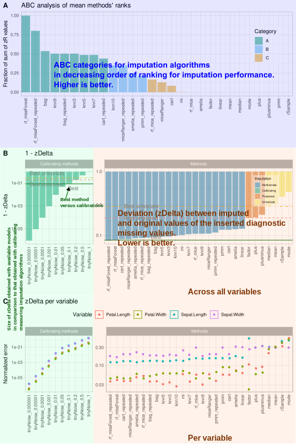

# opImputation: A model-agnostic framework for dataset-specific selection of missing value imputation methods in pain-related numerical data 

**opImputation** is an R package for comparing, benchmarking, and applying missing‑value imputation strategies to numerical tabular data. 
It is developed for biomedical and clinical research but is broadly applicable to any numerical dataset containing missing values.

---

## Features

- **Model‑agnostic benchmarking:** Compare imputation methods from diverse algorithmic families  
- **Dataset‑specific selection:** Automatically identify the best‑performing method for your data  
- **Automated imputation:** Optionally produce a final imputed dataset using the top method  
- **Parallel processing:** Efficient computation using the *future* framework (`future.apply`, `progressr`)  
- **Reproducible analysis:** Seedable, standardized workflows  
- **Extensible integration:** Add new methods or external benchmarking data easily  

---

## Installation
```r
# From GitHub
if (!requireNamespace("devtools")) install.packages("devtools")
devtools::install_github("JornLotsch/opImputation")

# From CRAN (preferred)
install.packages("opImputation")
```


**Package metadata:**  


| Type                    | R Package                                                                                                                                                                                                                               |
|-------------------------|-----------------------------------------------------------------------------------------------------------------------------------------------------------------------------------------------------------------------------------------|
| **Title**               | Optimal Selection of Imputation Methods for Bio‑Medical Data                                                                                                                                                                            |
| **Version**             | 0.4                                                                                                                                                                                                                                     |
| **Depends**             | R (≥ 3.5.0)                                                                                                                                                                                                                             |
| **Imports**             | parallel, Rfit, methods, stats, caret, ABCanalysis, ggplot2, future, future.apply, progressr, missForest, utils, mice, miceRanger, multiUS, Amelia, mi, reshape2, DataVisualizations, abind, cowplot, twosamples, ggh4x, ggrepel, tools |
| **License**             | GPL‑3                                                                                                                                                                                                                                   |
| **Authors**             | Jörn Lötsch, Alfred Ultsch                                                                                                                                                                                                              |
| **Creator, Maintainer** | Jörn Lötsch                                                                                                                                                                                                                             |
| **Repository**          | [https://github.com/JornLotsch/opImputation](https://github.com/JornLotsch/opImputation)                                                                                                                                                |
| **Date**                | 2025‑05‑03                                                                                                                                                                                                                              |

---

## Usage

### Basic example
```r
library(opImputation)

# Load example data
data_iris <- iris[,1:4]

# Add some misisngs
set.seed(42)
for(i in 1:4) data_iris[sample(1:nrow(data_iris), 0.05*nrow(data_iris)), i] <- NA

# Basic comparison with a subset of methods
results <- compare_imputation_methods(
  data = data_iris,
  imputation_methods = c("mean", "median", "knn5", "rf_missForest"),
  n_iterations = 10,
  imputation_repetitions = 10,
  seed = 42
)

# Retrieve automatically generated final imputation
imputed_data <- results$imputed_data
print(results$method_used_for_imputation)
```
---

## Main functions

### compare_imputation_methods
#### Call

| Argument                           | Description                                                                                                                                                                                   |
|------------------------------------|-----------------------------------------------------------------------------------------------------------------------------------------------------------------------------------------------|
| `data`                             | Numeric data frame or matrix. May contain existing missing values.                                                                                                                            |
| `imputation_methods`               | Character vector of imputation method names to compare. Default: `all_imputation_methods`. Must include at least two non‑calibrating methods.                                                 |
| `imputation_repetitions`           | Integer. Number of repeated imputations for each method and iteration (default = 20).                                                                                                         |
| `perfect_methods_in_ABC`           | Logical. If `TRUE`, calibration methods are included in the final categorization of methods (default value = FALSE). For testing purposes only; do not set to TRUE in real test environments. |
| `n_iterations`                     | Number of missing data patterns to test (default = 20).                                                                                                                                       |
| `n_proc`                           | Number of CPU cores for parallel processing (default: `getOption("mc.cores",2L)`).                                                                                                            |
| `percent_missing`                  | Numeric. Proportion of data to randomly set missing (0‑1; default = 0.1).                                                                                                                     |
| `seed`                             | Integer. Random seed for reproducibility (recommended).                                                                                                                                       |
| `mnar_shape`                       | Shape parameter for the *Missing Not At Random* (MNAR) mechanism (default = 1).                                                                                                               |
| `mnar_ity`                         | Degree of MNAR dependency (0–1; default = 0 → MCAR).                                                                                                                                          |
| `low_only`                         | Logical. If `TRUE`, insert missings only in lower‑valued observations.                                                                                                                        |
| `fixed_seed_for_inserted_missings` | Logical. Repeat identical random pattern across iterations.                                                                                                                                   |
| `max_attempts`                     | Maximum attempts to avoid creating empty rows (default = 1000).                                                                                                                               |
| `overall_best_z_delta`             | Logical. Compare to global best or category best method (default = FALSE).                                                                                                                    |
| `produce_final_imputations`        | Logical. If `TRUE`, generates final imputed dataset using the best‑ranked valid method (default = TRUE).                                                                                      |
| `plot_results`                     | Logical. If `TRUE`, create summary plots (default = TRUE).                                                                                                                                    |
| `verbose`                          | Logical. If `TRUE`, print best method information and turn on messaging (default = TRUE).                                                                                                                                    |

#### Returns

| Return Element | Description |
|-----------------|-------------|
| `all_imputation_runs` | List containing all imputation results generated across repeated simulation runs and missing‑data patterns. |
| `zdelta_metrics` | Standardized Δz (z‑delta) error metrics, including raw values, medians, and variable‑wise summaries quantifying deviations between original and imputed data. |
| `method_performance_summary` | Comprehensive performance summary of all imputation methods, including ranking metrics and Activity‑Based Classification (ABC) results. |
| `best_overall_method` | Name of the best‑performing imputation method for the analyzed dataset. |
| `best_univariate_method` | Name of the top‑performing univariate (single‑variable) imputation method. |
| `best_multivariate_method` | Name of the top‑performing multivariate (multi‑variable) imputation method. |
| `best_uni_or_multivariate_method` | Name of the leading combined uni/multivariate imputation method. |
| `best_poisoned_method` | Name of the top‑performing stress‑test method. |
| `abc_results_table` | Data frame containing the ABC (Activity‑Based Classification) analysis results, including method categories and performance scores. |
| `fig_zdelta_distributions` | Figure displaying the distribution of standardized Δz values for the best‑performing methods. |
| `fig_summary_comparison` | Combined figure integrating ABC classification and summary Δz plots for comparative visualization. |
| `final_imputed_data` | Final dataset with all missing values filled in using the best‑performing method (if `produce_final_imputations = TRUE`). |
| `final_imputation_method` | Name of the imputation algorithm automatically selected and applied to create the final complete dataset. |

---

### impute_missings
#### Call

| Argument | Description |
|-----------|-------------|
| `x` | Numeric data frame or matrix with missing values. |
| `method` | Imputation method name (default = `"rf_missForest"`). |
| `ImputationRepetitions` | Number of repetitions for methods ending with `_repeated` (default = 10). |
| `seed` | Random seed for reproducibility (recommended). |
| `x_orig` | Original dataset required for “poisoned” or “calibrating” methods. |


#### Returns  
A numeric data frame of the same dimensions and column names, with all missing values imputed.  

---

## Output and diagnostics

Performance evaluation is based on the standardized **Δz (z‑delta)** metric—  
a robust measure of the absolute deviation between true and imputed values.  
**ABC (Activity‑Based Classification)** categorizes imputation methods by their relative performance,  
highlighting “A‑class” models as top performers.

Example output table from `res_abc$df_abc_results[,1:3]`(generic dataset):

| abc_score | abc_category | method |
|-----------:|:-------------:|:-------|
| 36.5755 | A | plusminus |
| 21.8880 | A | cart_repeated |
| 17.5513 | A | pmm_repeated |
| 16.8750 | A | rf_mice_repeated |
| 16.0810 | A | miceRanger |
| 15.3061 | A | miceRanger_repeated |
| 9.7959 | A | cart |
| 9.0947 | B | pmm |
| 7.2345 | B | rf_missForest |
| 7.0602 | B | amelia_repeated |
| 4.8430 | B | miImp |
| 4.8430 | B | rf_mice |
| 3.2741 | C | plus |
| 3.2153 | C | rf_missForest_repeated |
| 1.9199 | C | amelia |
| 1.4161 | C | knn3 |
| 1.3021 | C | linear |
| 0.0000 | C | bag |
| 0.0000 | C | bag_repeated |
| 0.0000 | C | factor |
| 0.0000 | C | knn10 |
| 0.0000 | C | knn5 |
| 0.0000 | C | knn7 |
| 0.0000 | C | knn9 |
| 0.0000 | C | mean |
| 0.0000 | C | median |
| 0.0000 | C | mode |
| 0.0000 | C | rSample |

**Legend:**  
- `abc_score`: zDelta values. Quantitative measure of imputation performance (higher = better).  
- `abc_category`: ABC‑derived ranking class (“A” = top, “B” = medium, “C” = low).  
- `method`: Name of the evaluated imputation algorithm.  
“A‑class” methods (top seven in this example) represent the highest‑performing algorithms for the tested dataset.  
Lower tiers correspond to progressively weaker or calibration‑only approaches.


---

## Example summary plot

*Diagnostic summary from the Iris dataset: ABC curves and variable‑specific Δz distributions (different dataset than that used in above table).*



A: Standardized mean ranks for all imputation methods with ABC category coloring.  
B: Mean standardized Δz deviations for diagnostic missings.  
C: Variable‑level Δz distributions across methods.  

---

## When to use opImputation

- Biomedical or clinical datasets with incomplete numerical data  
- Multivariate analysis or machine‑learning preprocessing  
- Benchmarking and transparent method selection  
- Fully automated, reproducible imputation pipelines  

---
## Availability 

The **opImputation** package is available on [CRAN](https://CRAN.R-project.org/package=opImputation): https://cran.r-project.org/package=opImputation

---


## Citation

If you use **opImputation**, please cite:

> Lötsch J, Ultsch A. (2025).  
> *A model‑agnostic framework for dataset‑specific selection of missing value imputation methods in pain‑related numerical data.*  
> *Can J Pain* (in minor revision)

---

## Authors and license

- **Jörn Lötsch** (author, creator, maintainer)  
- **Alfred Ultsch** (author)  
- License: GPL‑3  

---

## About this project

`opImputation` is an R-based framework for automated, transparent, and reproducible selection of suitable missing‑value imputation methods for a given dataset. It provides a model‑agnostic approach that evaluates multiple candidate algorithms directly on the dataset to identify the most appropriate technique for that specific data structure, missingness pattern, and variable type.

The framework includes commonly used imputation families such as statistical, regression‑based, ensemble, tree‑based, and multiple‑imputation approaches. Its modular structure enables easy extension with additional or emerging methods, including deep‑learning‑based algorithms, ensuring long‑term flexibility across research domains.

Quantitative evaluation of candidate methods is based on *computed ABC (cABC)* analysis, which identifies statistically top‑performing algorithms through standardized performance metrics. For details on the theoretical background of cABC analysis, see:
Ultsch A, Lötsch J. *PLoS One.* 2015; 10(6): e0129767.  
Lötsch J, Ultsch A. *Sci Rep.* 2023; 13(1): 5470.

